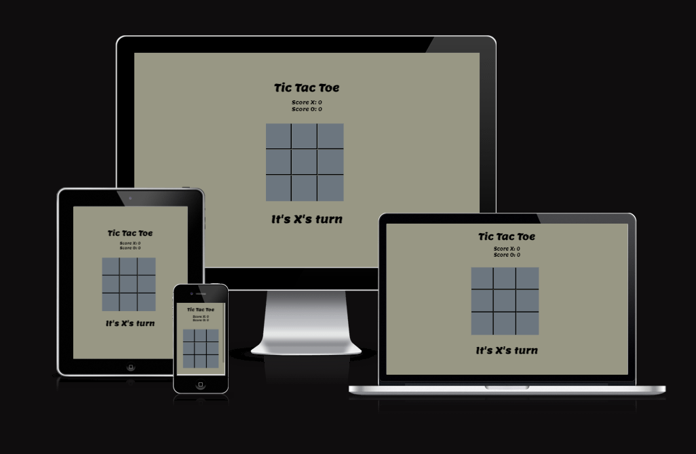
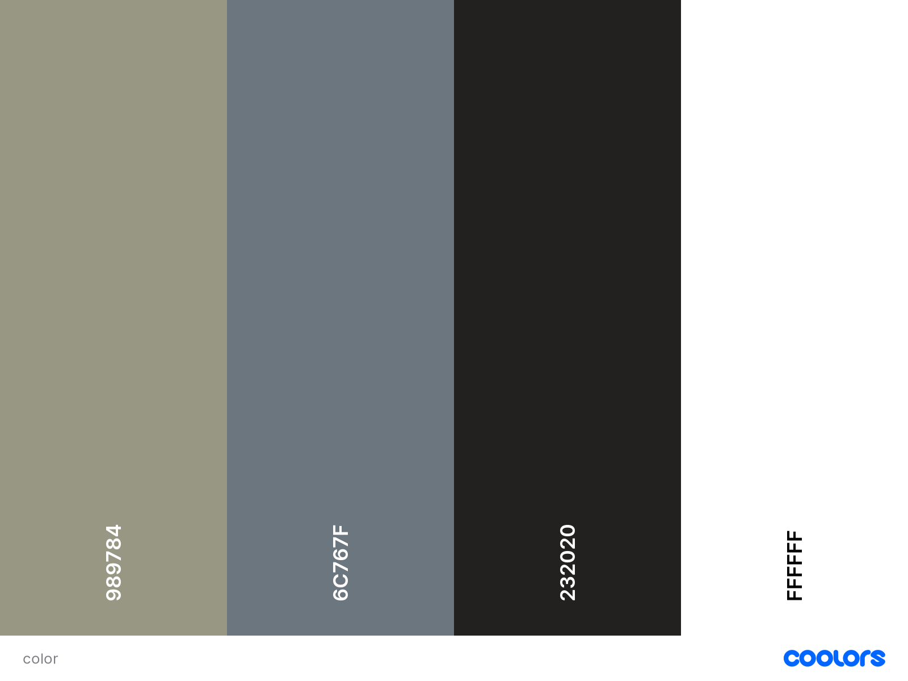
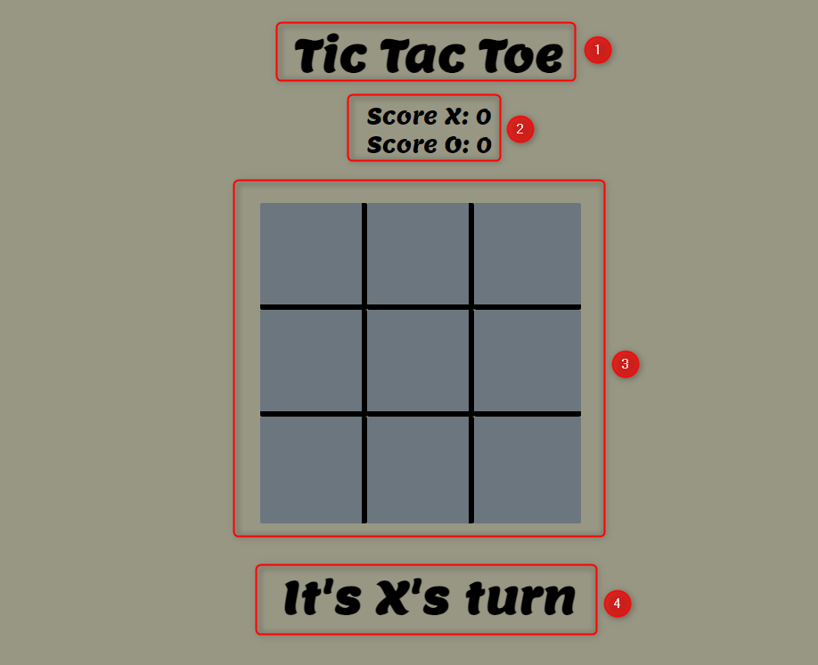
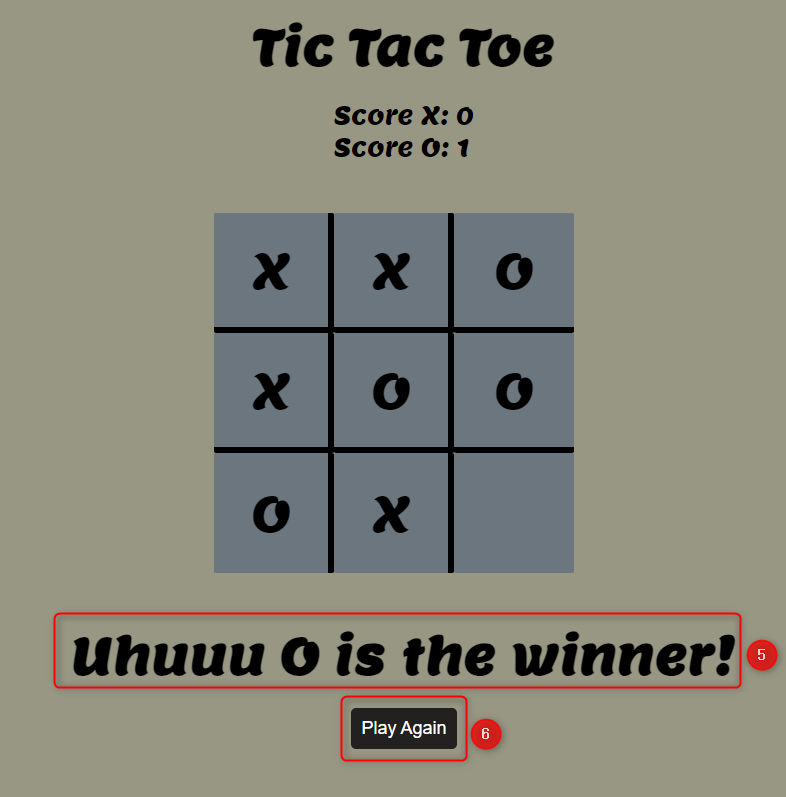
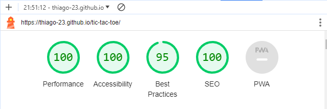
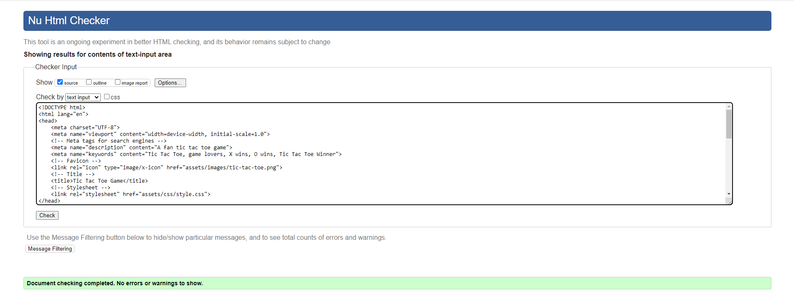
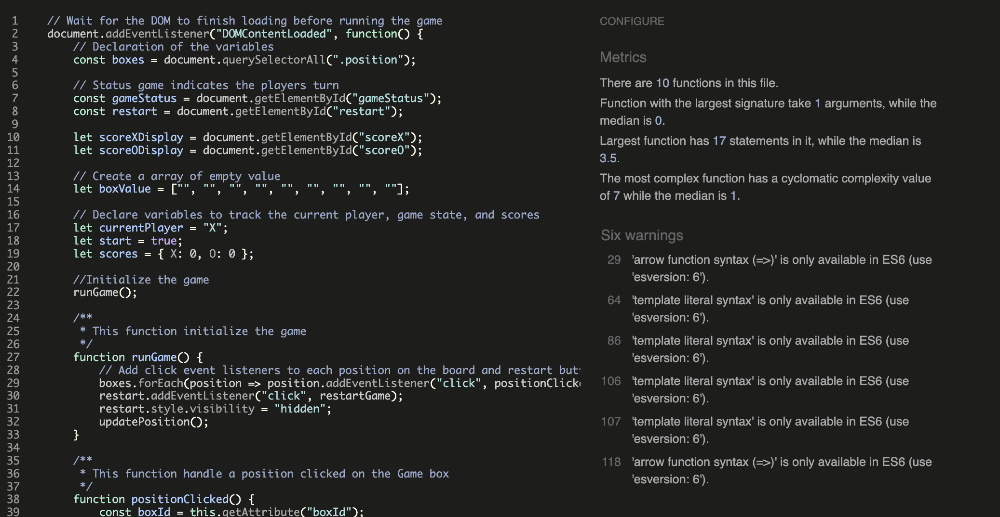
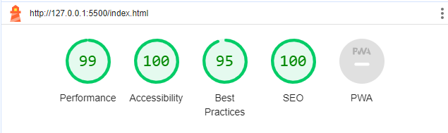
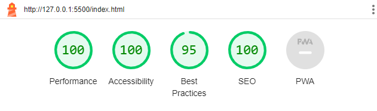

# Tic Tac Toe

Tic-Tac-Toe

Tic-Tac-Toe is a web-based game designed to bring people together through the classic and timeless enjoyment of tic-tac-toe. The game allows two players to take turns marking spaces in a 3x3 grid. The objective is to achieve a row, column, or diagonal of three of their marks (either "X" or "O") before the opponent does.

Join us in the world of Tic-Tac-Toe, where the experience of virtual game with the excitement of strategic gameplay.

## Demo

Link to the live site here: [Tic Tac Toe](https://thiago-23.github.io/tic-tac-toe/)

---

# Contents 
* [User Experience (UX)](#user-experience-ux)
    * [User Stories](#user-stories)
    
* [Languages Used](#languages-used)

* [Design](#design)
    * [Colour Scheme](#colour-scheme)

* [Features](#features)
    * [Existing Features](#existing-features)
    * [Accessibility](#accessibility)

* [Testing](#testing)

* [Deployment and Local Development](#deployment-and-local-development)
    * [Deployment](#deployment)
    * [Local Development](#local-development)
    * [How to Fork](#how-to-fork)
    * [How to Clone](#how-to-clone)

* [Solved Bugs](#solved-bugs)

* [Credits](#credits)
  * [Media](#media)
  * [Reference Material](#reference-material)

---

# User Experience (UX)

#### The Ideal User Key information
* A delightful and engaging interface for players of all ages.
* Visual cues to indicate the current player's turn.
* A visually appealing and responsive design that works well on various devices.

## User Stories

### User Goals

* As a user, I want a visually pleasing game interface.
* As a user, I want to be able to play the game on different devices seamlessly.
* As a user, I want the game to provide clear feedback on the winner or a draw.

### First-Time Player Goals

* As a first-time player, I want to quickly identify whose turn first.
* As a first-time player, I want a simple and intuitive interface to enjoy the game.
* As a first-time player, I want the game to be easy to navigate.

### Returning Visitor Goals
* As a returning visitor, I want the game to feel familiar and easy to pick up again.
* As a returning visitor, I want the option to play again on thee game is over.
* As a returning visitor, I want players expect a seamless experience across different devices.

---

# Languages used
* JavaScript
* HYML5
* CSS3

---

# Design

### Colour Scheme

---

## Features

### Existing Features
Game Rules
* The game follows traditional Tic Tac Toe rules.
* Two players take turns to place their "X" or "O" in an empty cell of the 3x3 grid.
* The first player to achieve three of their marks in a row, column, or diagonal wins.
* If the grid is filled without a winner, the game is a draw.

User Interface

1. A game title name indicates Tic Tac Toe.
2. A Score board displaying the game score.
3. Clear and responsive game board with visual 3x3 grid. 
4. A message indicators for player turns.
5. A message indicators for the game results.
6. A Play again button to reset the game and start a new game.

---

### Accessibility

* The website is accessible friendly by using:
  * Semantic HTML.
  * Sufficient color contrast throughout the site.
  * The game is designed with accessibility in mind, providing clear visual cues and readable text.

The accessibility was confirmed by running it through lighthouse in devtools.

--- 

## Testing

### W3C Validator

W3C Markup Validator were used to validate each code of the project to ensure there were no syntax errors.

### W3C HTML Validator
Index Page

### W3C CSS Validator

CSS - No syntax errors were found using Jigsaw css validator.

[Jigsaw Validator](https://jigsaw.w3.org/css-validator)

### JavaScript Validator

---

### Lighthouse

Lighthouse within the Chrome Developer Tools are used to test the performance, accessibility, best practices and SEO of the Tic Tac Toe game website.

* Index Page

-Mobile

-Desktop

---
## Deployment and Local Development

### Deployment

Github Pages were used to deploy the live website. The instructions to achieve this are below:

1. Log in (or sign up) to Github.
2. Find the repository for this project, tic-tac-toe.
3. Click on the Settings link.
4. Click on the Pages link in the left-hand side navigation bar.
5. In the Source section, choose main from the drop-down select branch menu. Select Root from the drop-down select folder menu.
6. Click Save. Your live Github Pages site is now deployed at the URL shown.

### Local Development

#### How to Fork

To fork the tic-tac-toe repository:

1. Log in (or sign up) to Github.
2. Go to the repository for this project, thiago-23/tic-tac-toe.
3. Click the Fork button in the top right corner.

#### How to Clone

To clone the tic-tac-toe repository:

1. Log in (or sign up) to GitHub.
2. Go to the repository for this project, thiago-23/tic-tac-toe.
3. Click on the code button, select whether you would like to clone with HTTPS, SSH or GitHub CLI and copy the link shown.
4. Open the terminal in your code editor and change the current working directory to the location you want to use for the cloned directory.
5. Type 'git clone' into the terminal and then paste the link you copied in step 3. Press enter.

---

## Solved Bugs

After asking friends and family to test the deploy Tic Tac Toe Game Project, it was identified the following bugs and fixed action were taken.

1. The h1 Tic Tac Toe:
   * It was not responsive with small devices.
   * Fixed by adding padding-top to make it responsive and visible on small devices.
2. The 'X' and 'O' size:
    * It was too small and hard to see on the board when playing the game. 
    * Fixed by change the font size.
3. Game font family:
    * It was to small and hard to see.
    * Fixed by changing to Lemon font.
4. HTML Validator errors
    * I was displaying an attribute name not allowed. 
    * Fixed by Modify HTML and JS attribute name to id. 

--- 

## Credits
## Media

* [Coolors](https://coolors.co/)
* [You Tube Flexbox Tutorial](https://www.youtube.com/playlist?list=PL4cUxeGkcC9i3FXJSUfmsNOx8E7u6UuhG)
* [Google Fonts](https://fonts.google.com/)
* [Mockup Screenshot Generator](https://ui.dev/amiresponsive)

---

## Reference Material

* [Love Maths Walkthrough project](https://github.com/Code-Institute-Solutions/love-maths-2.0-sourcecode)
* [Love Running Walkthrough project readme template](https://github.com/Code-Institute-Solutions/readme-template)
* [Flexbox](https://css-tricks.com/snippets/css/a-guide-to-flexbox/)
* [W3 School](https://www.w3schools.com/)
* [JavaScript doc](https://devhints.io/jsdoc)
* [Markdown Cheatsheet](https://guides.github.com/features/mastering-markdown/)

## Acknowledgements

* [Spencer Barriball](https://github.com/5pence?tab=repositories), My code institute Mentor who supports me on all my queries during my project.
* Tutor Assistance at Code institute when I had an issue with codeanywhere not running and when I had an issue trying to push my code to github.

